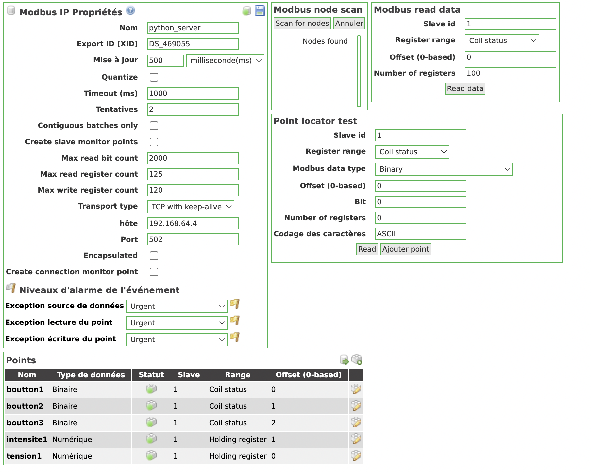

# ScadaBR configuration

First, you have to install [SCADABR](https://github.com/SCADAbr/ScadaBR) on one of your VMs.

## Configuration

⚠️ You have to use the same IP address for the SCADABR configuration and the Modbus server. ⚠️

